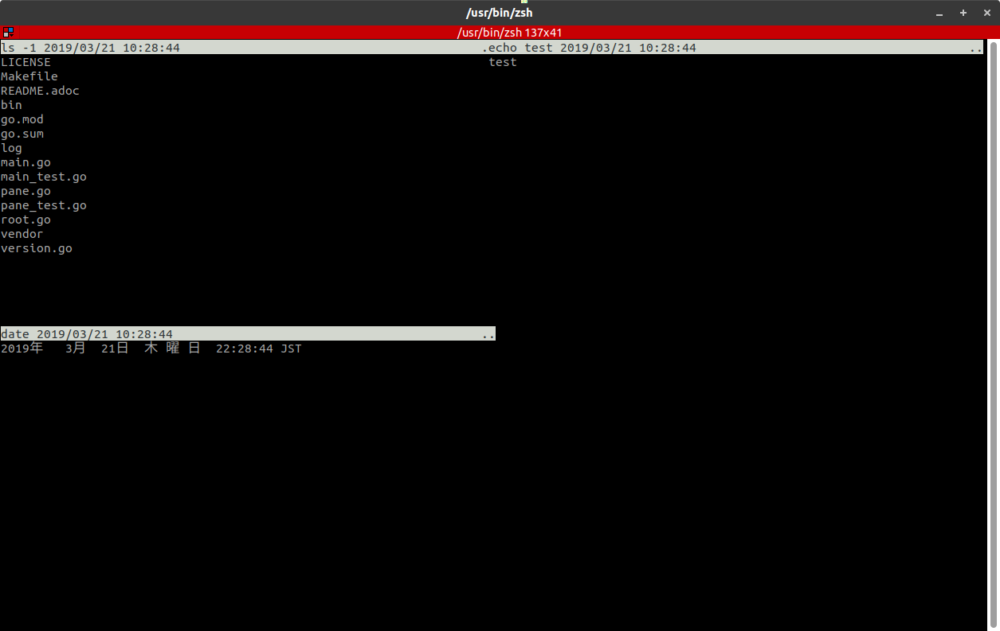
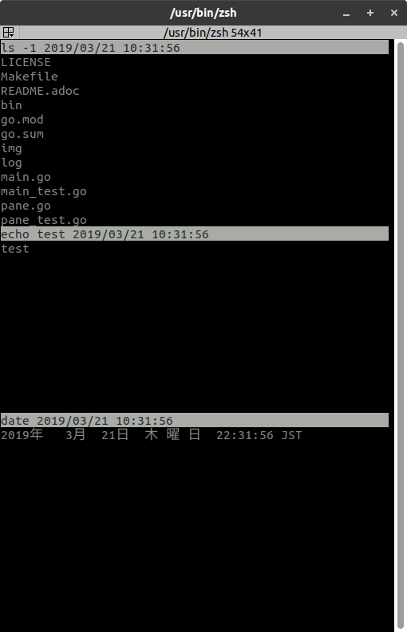
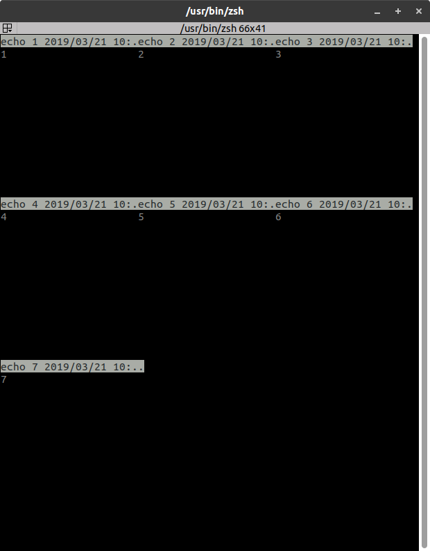

:toc:
:sectnums:

= vhwatch (Vertical/Horizontal Watch)

vhwatch provides watching multiple commands execution. +
vhwatch is inspired by `watch` command.

image:https://travis-ci.org/jiro4989/vhwatch.svg?branch=master["Build Status", link="https://travis-ci.org/jiro4989/vhwatch"]

== development

 go version go1.11 linux/amd64

== Usage examples

please press Ctrl-C to exit vhwatch.

[source,bash]
vhwatch 'ls -1' 'echo test' 'date'

[source,bash]
vhwatch -c 1 'ls -1' 'echo test' 'date'

[source,bash]
vhwatch -c 3 'echo 1' 'echo 2' 'echo 3' 'echo 4' 'echo 5' 'echo 6' 'echo 7'

== Install

[source,bash]
go get -u github.com/jiro4989/vhwatch

or

Download binary from https://github.com/jiro4989/vhwatch/releases[Releases].

== Help

[source]
----
vhwatch provides watching multiple commands execution.

Repository: https://github.com/jiro4989/vhwatch
    Author: jiro4989

Usage:
  vhwatch [flags]

Examples:
vhwatch -c 3 'echo test' 'date' 'ls -1' 'ls -lah'

Flags:
  -c, --col int           column count (default 2)
  -V, --vertical          vertical split panes
  -H, --horizontal        horizontal split panes
  -n, --interval int      seconds to wait between updates (default 2)
  -S, --chop-long-lines   cause lines longer than the screen width to be chopped (truncated)
  -h, --help              help for vhwatch
      --version           version for vhwatch
----
